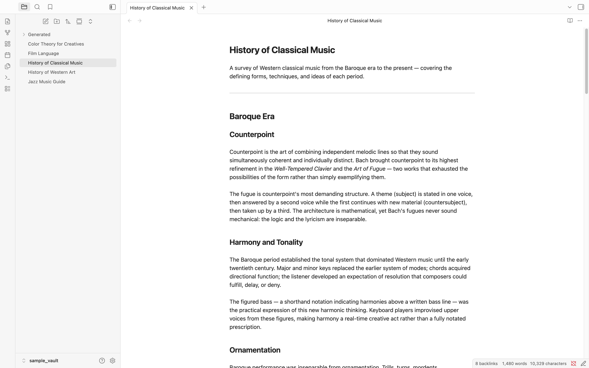
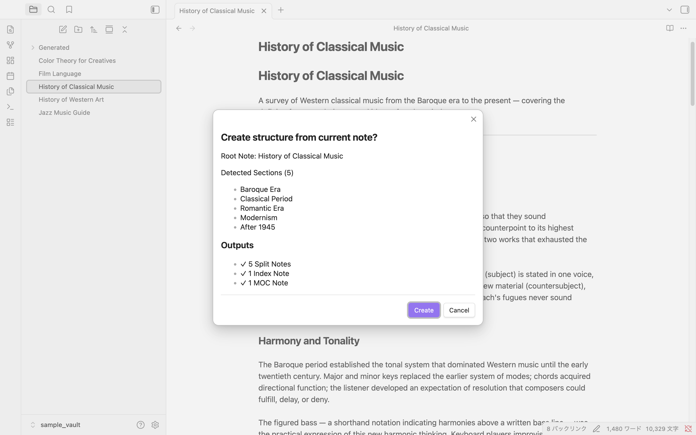

# Dualyze Structure

<p align="center">
  
</p>

Turn long notes into structured knowledge.

---

## Before

<p align="center">
  
</p>

A long note with multiple sections and subtopics.

---

## Create Structure

<p align="center">
  
</p>

Preview detected sections before generating.

---

## After

<!-- screenshot: knowledge-map.png -->

Generate split notes, structure index and visual knowledge maps.

---

## Features

| Feature | Description |
|---|---|
| **Structure Split** | Each `##` section becomes an independent note. `###` and deeper headings stay inside their parent. |
| **Parent Links** | Every split note gets `parent: "[[Source Note]]"` in its frontmatter for backlink navigation. |
| **Structure Index** | The original note is converted to a clean link list — your navigation hub. |
| **Knowledge Map** | A Mermaid flowchart in the MOC visualizes the full hierarchy: root → H2 → H3. |
| **MOC Generation** | A Map of Content lists all related notes and serves as an overview of the whole topic. |

---

## How to Run It

Three ways to trigger the command:

**Right-click in the editor** — open any note, right-click the body, select **Create Structure**.

**Right-click in the file explorer** — right-click a note in the left sidebar, select **Create Structure**.

**Command palette** — `Cmd+P` (Windows: `Ctrl+P`), type `Dualyze Structure: Create Structure`.

---

## Confirmation Dialog

Before writing any files, the plugin shows a preview of what will be created.

The dialog lists every section it detected, and shows exactly how many files will be generated. Click **Create** to proceed or **Cancel** to abort — nothing is written until you confirm.

---

## Generated Files

### Structure Index (the original note, rewritten)

```markdown
# History of Classical Music

## Structure

- [[History of Classical Music - Baroque Era]]
- [[History of Classical Music - Classical Period]]
- [[History of Classical Music - Romantic Era]]
- [[History of Classical Music - Modernism]]
- [[History of Classical Music - After 1945]]
```

### Split Note (with parent link)

```markdown
---
parent: "[[History of Classical Music]]"
---

# Baroque Era

Counterpoint is the art of combining independent melodic lines...
```

### MOC (with Knowledge Map)

```markdown
# History of Classical Music MOC

Generated from:
[[History of Classical Music]]

Sections: 5

## Overview

This MOC provides a navigation hub for the structured notes generated from [[History of Classical Music]].

## Knowledge Map

\`\`\`mermaid
%%{init: {'flowchart': {'useMaxWidth': true}}}%%
flowchart LR
  root["History of Classical Music"]
  root --> s1["Baroque Era"]
  s1 --> s1_1["Counterpoint"]
  s1 --> s1_2["Harmony and Tonality"]
  s1 --> s1_3["Ornamentation"]
  ...
\`\`\`

## Related Notes

- [[History of Classical Music - Baroque Era]]
- [[History of Classical Music - Classical Period]]
...
```

---

## Settings

Settings → Community Plugins → Dualyze Structure (gear icon).

| Setting | Default | Description |
|---|---|---|
| Output folder | `Generated` | Folder for split notes and MOC (relative to vault root) |
| Generate MOC | On | Whether to generate the MOC file |
| Knowledge visualization | Mermaid Flowchart | Visual style for the Knowledge Map in the MOC: Mermaid Flowchart / Text Tree / None |
| File naming style | Spaced | `Spaced`: `Title Index.md` / `Title MOC.md` — `Dot`: `Title.structure.md` / `Title.moc.md` |

---

## Sample Vault

The [`docs/`](docs/) folder in this repository is a ready-to-open Obsidian vault with five demo notes and the plugin pre-installed.

| Note | H2 Sections | H3 Sections | Best for |
|---|---|---|---|
| [History of Classical Music](docs/History%20of%20Classical%20Music.md) | 5 | 3 per section | Flowchart depth demo |
| [History of Western Art](docs/History%20of%20Western%20Art.md) | 6 | 2–3 per section | Large note demo |
| [Film Language](docs/Film%20Language.md) | 5 | 2–3 per section | Narrative structure |
| [Jazz Music Guide](docs/Jazz%20Music%20Guide.md) | 5 | 0–3 per section | Mixed hierarchy |
| [Color Theory for Creatives](docs/Color%20Theory%20for%20Creatives.md) | 5 | 2–3 per section | Creative topic |

**To try the sample vault:**

1. Download or clone this repository
2. Open the `docs/` folder as a vault in Obsidian
3. Trust community plugins when prompted
4. Open any sample note → right-click → **Create Structure**

---

## Installation

### Community Plugins (recommended)

1. Obsidian Settings → Community Plugins → Browse
2. Search for **Dualyze Structure**
3. Install → Enable

### Manual

1. Download `main.js` and `manifest.json` from [Releases](https://github.com/kojiman55/obsidian-dualyze-structure/releases/latest)
2. Place them in your vault's `.obsidian/plugins/dualyze-structure/` folder
3. Restart Obsidian → Settings → Community Plugins → enable **Dualyze Structure**

---

## How Splitting Works

- Notes are split at every `##` (H2) heading
- `###` (H3) and deeper headings stay inside their parent H2 note
- Lead text before the first `##` is not included in split notes
- File names follow the pattern `<Note Title> - <Section Heading>` (example: `History of Classical Music - Baroque Era`)
- Characters invalid in file names (`/ \ : # ^ [ ] |`) are replaced with `-` or removed
- Running the plugin a second time on the same note appends `-1`, `-2`, etc. — the original is never overwritten

---

## License

MIT
